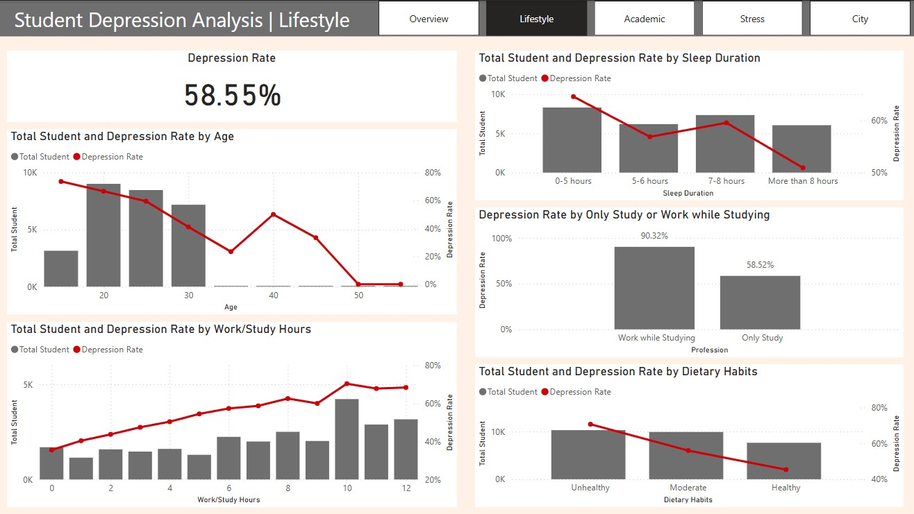
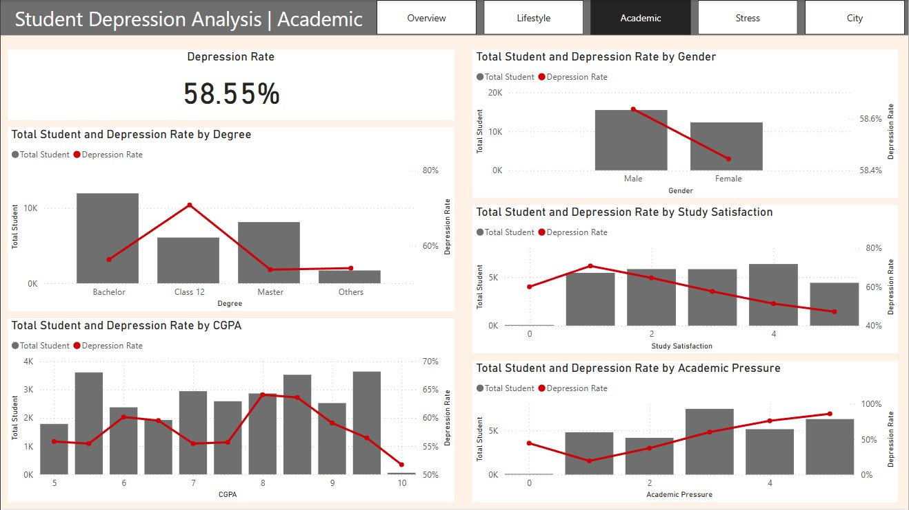
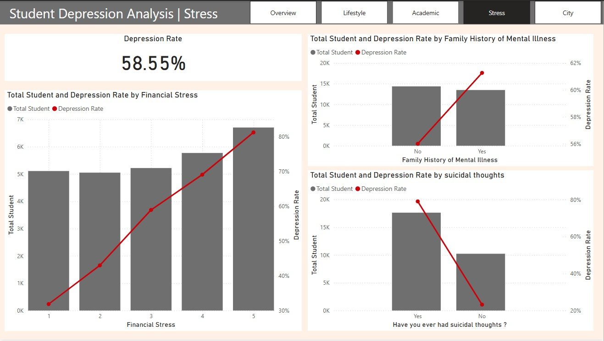
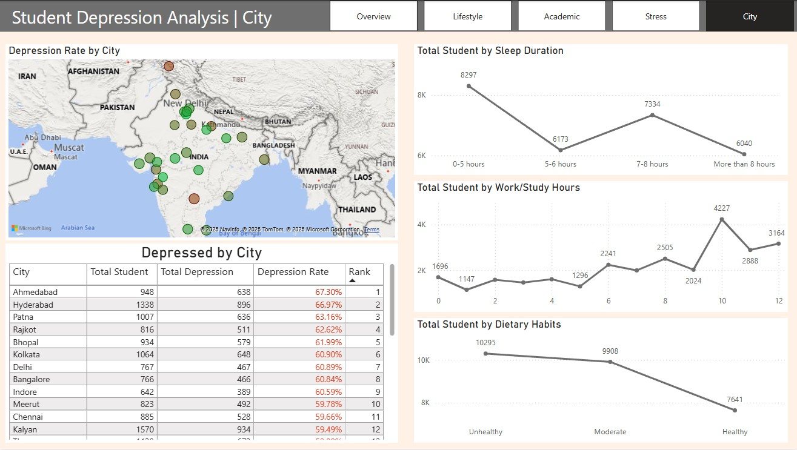

# 📊 Depression Analysis in Students

## 📑 Table of Contents
1. [Introduction](#-introduction)
2. [Dataset Overview](#-dataset-overview)
3. [Data Cleaning Process](#-data-cleaning-process)
4. [Exploratory Data Analysis (EDA)](#-exploratory-data-analysis-eda)
5. [Visualization & Insights](#-visualization--insights)
    1. [Overview](#1️⃣-overview)
    2. [Lifestyle & Well-being](#2️⃣-lifestyle--well-being)
    3. [Academic Factors](#3️⃣-academic-factors)
    4. [Stress Factors](#4️⃣-stress-factors)
    5. [City-wise Trends](#5️⃣-city-wise-trends)
6. [Key Findings & Conclusion](#-key-findings--conclusion)
7. [How to Use This Project](#-how-to-use-this-project)
8. [Future Work & Improvements](#-future-work--improvements)
9. [References](#-references)

## 📌 Introduction
Depression among students has become a growing concern in today's academic environment. This project aims to analyze student depression patterns using a dataset from Kaggle and provide insights through data visualization in Power BI. By leveraging Power Query for data cleaning and Power BI for analysis, this project uncovers key factors contributing to student depression and offers data-driven insights to support mental health awareness initiatives.

## 📂 Dataset Overview
- **ID**: A unique identifier assigned to each student record to ensure individual tracking.
- **Gender**: Self-reported gender of the student (e.g., "Male", "Female", or other identifiers), useful for analyzing trends across gender groups.
- **Age**: The student's age in years, helping identify age-related trends and correlations.
- **City**: The geographic location of the student, enabling regional analysis of mental health trends.
- **Profession**: The student’s current job title or employment status, providing context on work-related stress factors.
- **Academic Pressure**: A numeric rating quantifying the level of stress from coursework, exams, and performance expectations.
- **Work Pressure**: A numeric indicator reflecting the level of pressure from job-related responsibilities, particularly relevant for students who work while studying.
- **CGPA**: The Cumulative Grade Point Average, used to analyze the relationship between academic performance and mental health.
- **Study Satisfaction**: A measure representing the student’s satisfaction with their academic experience, covering aspects such as course quality and institutional support.
- **Job Satisfaction**: A measure indicating how satisfied the student is with their job, helping assess work-life balance and its impact on well-being.

## 🔄 Data Cleaning Process
The data cleaning process was conducted using **Power Query**:
- **Checked for missing values, errors, and duplicates**: Identified and removed errors in the "Financial Stress" column.
- **Validated data types**: Ensured all columns were assigned the appropriate data types.
- **Filtered outliers**:
  - The dataset primarily contained students from **India**; therefore, non-Indian cities were filtered out.
  - Values labeled as "Others" in **Dietary Habits** and **Sleep Duration** were removed for consistency.

## 📊 Exploratory Data Analysis (EDA)
- The dataset comprises **27,844 students** from **India**.
- **16,303 students** (approximately **58.55%**) were identified as having depression.

## 📈 Visualization & Insights

### 1️⃣ Overview
- The dashboard presents a summary of **total students (27,844)** and **students diagnosed with depression (16,303)**.
- Depression rate is **58.55%**.
- Breakdown by **gender, degree level, and age**.
- A **table and map** display cities with the highest depression rates.

### 2️⃣ Lifestyle & Well-being
- Students with **long work/study hours**, **less sleep**, and **unhealthy dietary habits** have a **higher depression rate**.
- Those who balance both **work and study** also show a higher likelihood of depression.

### 3️⃣ Academic Factors
- Students in **Class 12** have the **highest depression rate**.
- **Low study satisfaction** and **high academic pressure** significantly correlate with depression.
- **CGPA and gender** were not major contributors to depression.

### 4️⃣ Stress Factors
- **High financial stress** and **suicidal thoughts** are strongly linked to depression.
- However, **family history of mental health issues** was not a major predictor of depression in this dataset.

### 5️⃣ City-wise Trends
- The dashboard displays **total students, students diagnosed with depression, and depression rates by city**.
- It highlights **lifestyle trends in different cities**.

## 📌 Key Findings & Conclusion
The analysis identified the following key factors contributing to depression among students:
- **Lifestyle & well-being** (long work/study hours, unhealthy habits, lack of sleep)
- **Study Satisfaction & Academic Pressure**
- **Financial Stress**
- **Suicidal Thoughts**

## ⚡ How to Use This Project

### **Power BI Report**
1. Download `student_depression_analysis.pbix`
2. Open with **Power BI Desktop**
3. Interact with the dashboard to explore insights

### **Using Cleaned Data**
- The cleaned dataset (`student_depression_dataset_clean.csv`) can be imported into Python, R, or SQL for further analysis.

## 🚀 Future Work & Improvements
- Expand dataset with additional mental health parameters.
- Implement **machine learning models** to predict high-risk students.
- Conduct **sentiment analysis** on student feedback.

## 🔗 References
- [Kaggle Dataset](https://www.kaggle.com/datasets/adilshamim8/student-depression-dataset)
