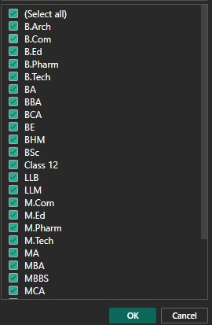
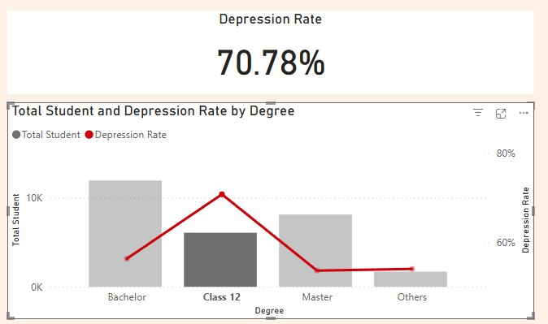
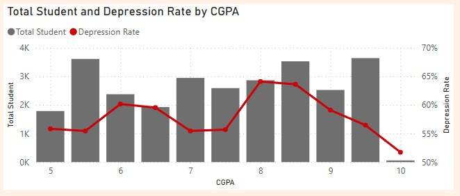
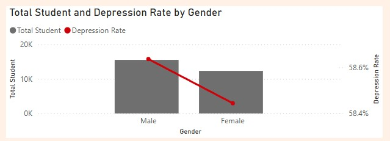
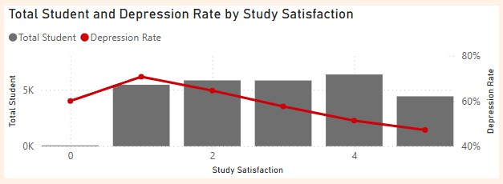
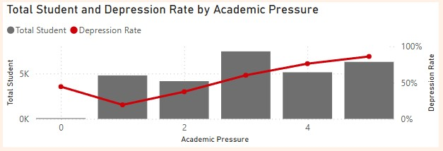
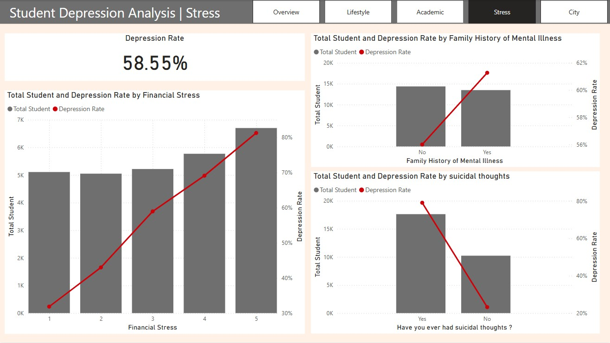

# Student-Depression-Analysis

<h3 align="left">1. I started to download the Student Depression Dataset from Kaggle and this is a Data Description</h3>

- Format: CSV (each row represents an individual student)
- Features:
<h5 align="left">ID: Unique identifier for each student</h5>
<h5 align="left">Demographics: Age, Gender, City</h5>
<h5 align="left">Academic Indicators: CGPA, Academic Pressure, Study Satisfaction</h5>
<h5 align="left">Lifestyle & Wellbeing: Sleep Duration, Dietary Habits, Work Pressure, Job Satisfaction, Work/Study Hours</h5>
<h5 align="left">Additional Factors: Profession, Degree, Financial Stress, Family History of Mental Illness, and whether the student has ever had suicidal thoughts</h5>

- Target Variable:
<h5 align="left">Depression_Status: A binary indicator (0/1 or Yes/No) that denotes whether a student is experiencing depression</h5>

<h3 align="left">2. I open Power BI Desktop and load the dataset to inspect and clean the data for making the report.</h3>

<h5 align="left">First, The id column is a primary key and it does not have duplicates, outliers, or errors. So I don't have to do anything in this column.</h5>
<h5 align="left">In the next step, I explore the other columns to check for missing values or errors. And I found the error in the column financial stress.</h5>

<h5 align="left">So I removed the error from the table. Now my table does not have any missing values or errors.</h5>
<h5 align="left">In the next step, I start checking for outliers in each column and treating them so that they are not included in the analysis and clean some values for more usability.</h5>
<h5 align="left">Then I found an outlier from the city column. I inspected the values from this column and found almost all of these values come from India. For the outlier, I don't know if it's a misspelling or something, and some value I can't find true value. I decided to filter it out Because I want to focus on the value in India.</h5>

<h5 align="left">Next, I replace the value in the Sleep Duration column to make it easier to visualize then I filter the value "others" in this column out and also filter in Dietary Habits column.</h5>
 
<h5 align="left">The number of values ​​is slightly reduced from the original file, but the data set is clean and ready for analysis and visualization.</h5>

<h3 align="left">3. Time to analysis about student depression and visualization.</h3>
<h3 align="left">Here this is my result</h3>
<h3 align="left">This is the first page "Overview"</h3>

<h5 align="left">On this page, at the top, you can see the total number of students in the sample, students who are currently depressed, and the depression rate.</h5>
<h5 align="left">Scroll down and you can see the distribution of student age ranges, and the pie chart and donut chart on the right show the distribution by Gender and Degree level.</h5>
<h5 align="left">The table and map below show which cities have the highest depression rates and are ranked by depression rate.</h5>
<h5 align="left">In summary, This page shows that there are a total of 27,844 students, and of these, more than 16,000 (approximately 58.55%) are in the depressed group. And show that Ahmedabad city has the highest depression rate.</h5>

<h3 align="left">Next is the second page "Lifestyle"</h3>

<h5 align="left">The “Lifestyle”  page,  page summarizes data on the depression rate of students based on various lifestyle factors. with details on dimensions related as follows:</h5>
<h5 align="left">1. Student and Depression Rate by Age
The upper left graph shows the total number of students in each age group (Bar) compared to the incidence rate of depression (Line).
It can be seen that the younger group (aged 15-20 years) has the highest rate of depression, which is 73.60%, followed by the older age group.</h5>

<h5 align="left">2. Total Student and Depression Rate by Work/Study Hours
The lower left graph shows the total number of students (Bar) by the number of work/study hours per day. The Line shows the depression rate in each hour range.
It can be seen that the more work/study hours, the higher the depression rate tends to be. The group with 0 working/study hours has the lowest depression rate at 35.50%, while the group with 12 working/study hours has a depression rate at 68.36%.</h5>

<h5 align="left">3. Student and Depression Rate by Sleep Duration
The upper right graph is divided by sleep duration.
It can be seen that the group that slept less than 5 hours per day had the highest depression rate at 64.53%, and the group that slept more than 8 hours had a depression rate at 50.91%.</h5>

<h5 align="left">4. Student and Depression Rate by Only Study or Work while Studying
The middle right graph shows a comparison between students who work while studying and those who do not work.
The group that works while studying has a very high depression rate at 90.32%.</h5>

<h5 align="left">5. Total Student and Depression Rate by Dietary Habits
The graph on the lower right shows the types of eating behaviors (Dietary Habits) such as Unhealthy, Moderate, and Healthy.
It can be observed that the group with Unhealthy eating behaviors has the highest depression rate at 70.75%, but the group with healthy eating behaviors has a depression rate at 45.37%.</h5>

<h5 align="left">In summary, This page highlights the relationship between student lifestyle and depression rates, Sleep Duration, Overwork or Overstudy, and Dietary Habits, which appear to have an impact on depression rates.</h5>

<h3 align="left">Next is the third page "Academic"</h3>

<h5 align="left">This “Academic” page, page presents data and depression rates among students based on educational factors, with details on dimensions related as follows:</h5>
<h5 align="left">1. Total Student and Depression Rate by Degree</h5>
<h5 align="left">The degree column has too many types to present here, but I found that the ones starting with B are Bachelor and M are Master. I created a new column with</h5>
<h5 align="left">"Mod Degree = IF(student_depression_dataset[Degree] = "Class 12", "Class 12",
IF(LEFT(student_depression_dataset[Degree], 1) = "B", "Bachelor",
IF(LEFT(student_depression_dataset[Degree], 1) = "M", "Master", "Others")))"</h5>
<h5 align="left">reducing the degree types to just (Bachelor, Class 12, Master, Others), which made it easier to focus.</h5>

<h5 align="left">The graph shows the total number of students (Bar) at each level of study (Bachelor, Class 12, Master, Others) compared to the depression rate (Line).
The graph shows that the group with the highest depression rate is Class 12, which has a depression rate at 70.78%.</h5>

<h5 align="left">2. Total Student and Depression Rate by GPA
A graph showing the GPA (Grade Point Average) value compared to the number and depression rate.
It is often expected that a low GPA value may be related to stress or pressure, and result in a higher rate of depression.
From the graph, you may see fluctuations in depression rates in each GPA range, but most are still in the range at 50–65%.
Although the group with the highest GPA has the lowest rate of depression, it is not much different from the other groups.
From this graph, I think that the GPA does not affect the rate of depression much.</h5>

<h5 align="left">3. Total Student and Depression Rate by Gender
This graph compares Male and Female, where Bar is the number and Line is the depression rate.
You can see that the depression rate between males and females is not much different (around 58–59%).
The number of males in the sample may be higher, but the proportion of depression is still close to the average.
So I think the difference in gender does not affect the incidence of depression.</h5>

<h5 align="left">4. Total Student and Depression Rate by Study Satisfaction
This graph shows the level of “Study Satisfaction”, which can be divided into levels of 0–5.
The Bar is the number of people in each satisfaction level, and the Line is the depression rate.
It can be seen that the trend is that low satisfaction has a relatively high depression rate, while high satisfaction has a lower rate.</h5>

5. Total Student and Depression Rate by Academic Pressure
<h5 align="left">This graph shows the level of “Academic Pressure”, which can be divided into levels of 0–5.
The Bar is the number of people in each pressure level, and the Line is the depression rate.
It can be seen that the trend is that low academic pressure has a low depression rate, while high academic pressure has a higher rate.</h5>

<h5 align="left">In summary, This page shows the link between educational factors and depression rates, finding that:
Study satisfaction is a clear factor: low satisfaction means a high likelihood of depression.
Higher pressure in school can also lead to higher rates of depression.</h5>

<h3 align="left">Next is the fourth page "Stress"</h3>

<h5 align="left">This “Stress” page, page presents data and depression rates among students based on stress factors and additional factors followed by financial stress, family history of mental illness, and suicidal thoughts.
you can see students who have more financial stress are likely to have a higher depression rate and those who have suicidal thoughts also have a higher depression rate.
However, for students who have a family history of mental illness, I think the difference in this factor does not affect the incidence of depression.</h5>

<h3 align="left">And this is the final page "City"</h3>

<h5 align="left">This "City" page, the page presents the city ranked by depression rate and Trends about lifestyle in the city you can filter by clicking on the table at the left bottom to see details about each city. You can download my pbix file to see more about details.</h5>
